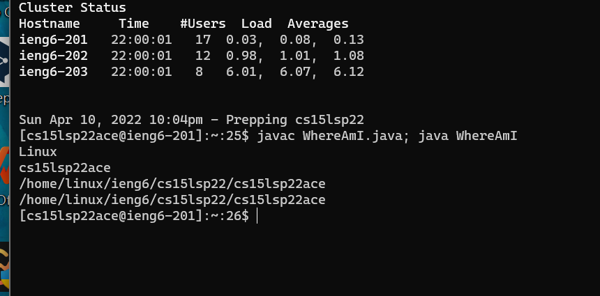

# Remote Access
## Installing VScode
You can go to this [link]https://code.visualstudio.com/ website. Follow the instructions on the website and download the vscode. There are versions for all the major operating systems, like OSX (for Macs) and Windows (for PCs). You can choose the version based on your own computer. Here is the image of vscode.

## Remotely Connecting
First, you need to look up your course-specific account for CSE15L here: [link]https://sdacs.ucsd.edu/~icc/index.php. Second, you click the terminal on the vscode and input your specific account. Here is the code: $ssh cs15lsp22zz@ieng6.ucsd.edu
You should replace zz with your own number. Then it will ask you to type your passwords. Here is the screen shot of windows termminal when you successfully log in.

## Try some commands
After connecting to the remote computer, you are able to try some commands in the terminal. For example, ls will list the files you have. pwd will display the pathname of the working directory. Other commands like mkdir, lat, cd are all useful commands waiting for you to explore.
Here is the screen shot of trying -lat, which is the combination of -l -a -t commands.

## Moving Files with scp
It is too complex for us to copy files from the local computer to the remote one in the old ways such as email or google drive. Now we can use another way which is scp. Create a file in your own computer named WhereAmI.java and put some contents into it. Then, in the terminal, you can run this command (using your username): scp WhereAmI.java cs15lsp22zz@ieng6.ucsd.edu:~/ Next, you will be asked to type your password. Here is the screen shot when you success run the code.

## Setting an SSH Key
You may find that whenever we want to use scp, we have to type our password. To solve this problem, we have a great solution called ssh keys which used a program named ssh-keygen. It will create two keys. One is public key on the servery and another one is private key on your own client. First, after typing ssh-keygen, it will show the directory of two keys. When it shows "enter passphrase", do not type anything. When it shows the password, type in the directory of your public key file. Then you finished the key set. When you want to log in next time, you do not need to type the password anymore. Here is the screen shot when you success.

## Optimizing Remote Running
There are mutiple ways for you to concise how you run the code. First, you may use quotes at the end of an ssh command so that you can directly run it on the remote computer. This is what the code looks like: $ ssh cs15lsp22zz@ieng6.ucsd.edu "ls" Second, you may use semicolons to run multiple commands at the same line. Third, you can use the up-arrow on the keyboard to recall the last command you have run before. By using these skills, you are able to optimize your remote running. Here is the screenshot of using semicolons.
